# PrithviScan — URTC feature roadmap (sequenced waves)

**Live site:** https://prithviscan.web.app  
**Current inventory:** [`FEATURES.md`](../FEATURES.md)  
**Audience:** PM / engineering / URTC reviewers  
**Updated:** 2026-08-03

This roadmap **replaces** earlier scattered L1–L6 / Release A–D notes. Work extends existing field tools, fusion Functions, and org/markets systems — not 22 greenfield products.

---

## 0. Already shipped — do not re-scope

| Capability | Status | Reuse |
|------------|--------|--------|
| Field inputs, CHC hire, what-if irrigate/fert, Action Center, NDVI VRA | Live / Partial | Field tools |
| NASA POWER + MODIS/SMAP/HLS archive + `fuseFieldInsight` | Live | Fusion Functions |
| Collaborate, org multi-field RBAC, prices + nearby markets, scenario ROI | Live / Partial | Org / markets |
| Country packs IN/US (+ BR/KE/NG/ID) | Live | [`js/region.js`](../js/region.js) |
| Profile DPDP export/delete + consent | Live | [`js/privacy-data.js`](../js/privacy-data.js) |
| Ask AI widget + `aiChat` | Live | Agronomist via RAG — not a new chatbot |

---

## Wave dependency order

```mermaid
flowchart LR
  subgraph waveA [Wave A Science Core]
    SoilMoist[Soil moisture 7d]
    Stress[Pest disease heat water]
    Irrig[Irrigation planner]
    Yield[Yield harvest profit]
  end
  subgraph waveB [Wave B Ops Advisor]
    Fert[Fertilizer optimizer]
    Mach[Machinery ops]
    Rec[Crop recommender]
  end
  subgraph waveC [Wave C Spatial Sensors]
    Bound[Boundary snap]
    Fusion[Sentinel Landsat SAR]
    CropHist[Crop history]
  end
  subgraph waveD [Wave D Trust Money Global]
    Finance[Financial dashboard]
    Carbon[Carbon climate]
    Privacy[Privacy dashboard]
    Packs[Country packs]
  end
  subgraph waveE [Wave E Experience]
    Community[Community posts]
    Market[Marketplace intel]
    VoiceImage[Voice and photo AI]
    Drone[Drone sim NDVI]
  end
  waveA --> waveB --> waveC --> waveD --> waveE
```

---

## Wave A — Science core (URTC primary demo) — **Shipped**

**Acceptance:** Open a field → 7-day moisture, 4 risk scores with actions, irrigation recommendation, yield/profit range, all with source timestamps.

| ID | Feature | Implementation |
|----|---------|----------------|
| A1 | Soil moisture forecast (7-day) | `soilMoistureForecast` → Soil intelligence panel |
| A2 | Pest / disease / heat / water early warning | `riskSuite` + risk map zones → Action Center |
| A3 | Smart irrigation planner | `irrigationPlan` + create irrigate task |
| A4 | Yield + harvest + profit | `yieldPrediction` with confidence interval |

---

## Wave B — Ops advisor — **Shipped**

| ID | Feature | Implementation |
|----|---------|----------------|
| B1 | Fertilizer optimization | `fertilizerOptimize` + prescription path |
| B2 | Machinery optimization | `machineryOptimize` (fuel, schedule, maintenance, breakdown risk) |
| B3 | AI crop recommendation | `recommendCrops` panel |
| B4 | Soil NPK + degradation + carbon score | `soilIntelligence` (honest uncertainty) |

---

## Wave C — Spatial & sensors — **Shipped**

| ID | Feature | Implementation |
|----|---------|----------------|
| C1 | Field boundary snap | Draw → `snapFieldBoundary` → GeoJSON on field doc |
| C2 | Multi-sensor fusion expand | Archive: HLS S2, HLS Landsat, Sentinel-1 SAR; Planet slot reserved |
| C3 | Crop classification history | Seasonal log + rotation tip |

---

## Wave D — Trust, money, global packs — **Shipped**

| ID | Feature | Implementation |
|----|---------|----------------|
| D1 | Farm financial dashboard | `/finance` rollup + loan calculator |
| D2 | Carbon credit estimator + climate resilience | `carbonAndClimate` on advisor panel |
| D3 | Privacy dashboard upgrade | Consent / anonymize / export audit on `/profile` |
| D4 | Country intelligence packs | IN, US, BR, KE, NG, ID |

---

## Wave E — Experience multipliers — **Shipped**

| # | Build as |
|---|----------|
| 11 Social | Community feed on Collaborate (moderated) |
| 12 Marketplace | Informational intel on nearby markets |
| 17 AI Agronomist | RAG over crop-guides + info-data in same widget |
| 18 Voice | Web Speech → field tools |
| 19 Image GT | Photo + disease/deficiency/pest labels on feedback |
| 20 Drone sim | Upload → simulated NDVI + pest spots |

---

## URTC demo script

1. Place IN or US field → region currency appears.  
2. Open field → Soil moisture 7-day + Risk Suite map.  
3. Accept irrigation + spray/scout recommendations into Action Center.  
4. See yield/profit prediction with confidence.  
5. Run crop recommender / fertilizer / machinery optimizer.  
6. Export prescription + privacy export.  
7. Boundary snap + Landsat/SAR layer + carbon/resilience scores.  
8. Community post · Voice · Photo GT · Drone sim · AI Agronomist.

---

## Engineering rules (all waves)

- One new field tool button per major product (analysis-on-top UX).  
- Every model output: `source` / `generatedAt` / `modelVersion` / `confidence`.  
- Region-aware money via `formatMoney` / market catalogs.  
- Prefer Cloud Functions for Earth data; keep UI static hosting.  
- Prefer provenance + confidence bands over fake precision.  
- Update FEATURES/ROADMAP after each wave; do **not** list unfinished items as Live.

---

## Next hardening (not new products)

1. Real Planet key only if free academic tier confirmed.  
2. Labeled yield dataset → replace heuristic yield bands with trained model.  
3. Lab soil CSV upload beside NPK proxy.  
4. Nested farm groups under orgs only if multi-farm orgs need containers.  
5. Harden SMS/WhatsApp alert providers; EuroSAT classifier export into Functions.

---

*When a feature ships, move it into [`FEATURES.md`](../FEATURES.md) and keep wave tables honest.*
